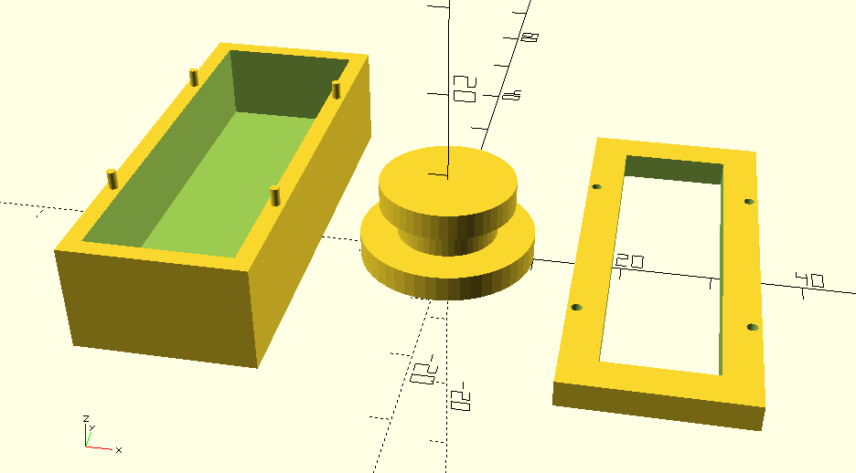

# Comments to distant_main_signal developement

## 26.11.2024

**message:** new scad for distant-main_signal

**id:** 86ad868b4a1d5f8c6394f25796be168684d56a8c

**pro**

control is easy to move

**con**

cover to height -> it was difficult to get the cotrol in the cover

conecting pins broke instantly, connecting hole was not closed at the outer wall

## 26.11.2024

**message:** new pins and first barrier try to lock the signal

**id:** 46c05107ef40ff97ae60b89e25f5d0254835667b

**pro**

thiner cover height -> it was easier to get the control in the cover

new pins don't break and they hold the cover

first mechanism to lock a position: wall in the middle -> bottom of control has a wider and smaller side

**con**

the sides with no pins don't close completly

the pins need glue to hold the cover permanently

because of the barrier, the frame has to be wider.

> To see through the cover, the hole signal has to be wider

To print the overhang of the control it has to be supported. The support wasn't completly removed -> the control is heavy to move

it is difficult to turn the control to lock it

## 28.11.2024

**message:** connecting parts on all four sites
handle for easier use

**id:** 287bfa23482bfc98d279bebb17a10f50b9ac8a16

**pro**

the pins are higher an on all 4 sides -> the cover holds without glue and on all sides (nice click moment)

handle to turn move and turn the control

**con**

thicker wall to have holes for the pins and later the magnets

> wider frame
> 
> > it is dificult to get the control in the cover
> > 
> > smaller window to see in the signal
